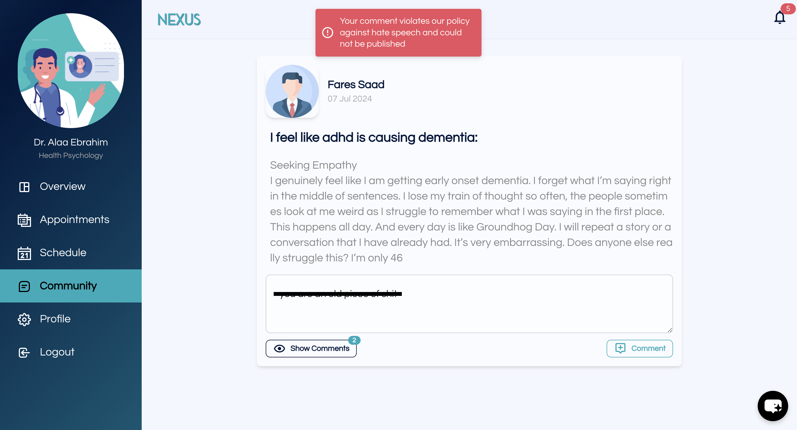
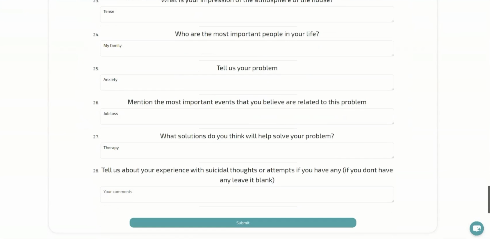
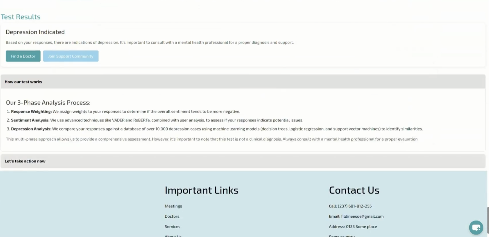

# Sentiment Analysis Flask Application for Nexus Platform

## Description
This repository contains a **Flask-based Sentiment Analysis API** developed for the **Nexus mental health platform**.  
Nexus is a web application that enables users to interact through social forums, complete mental health assessments, and book appointments with mental health professionals.  
The platform also provides a dedicated space for doctors, where they can be booked by users, view forum discussions, and offer professional advice.  

🔗 **Nexus Platform Repository**  
[https://github.com/AlaaEbrahim0/mental-mediator-api-graduation-project](https://github.com/AlaaEbrahim0/mental-mediator-api-graduation-project)

---

## Features

### Core Functionalities
- **Forum Sentiment Analysis**: Detects hate speech, toxic language, and overall sentiment of user-generated posts to maintain a safe community.
- **Depression Assessment**: Combines Beck’s Depression Inventory, general sentiment analysis, and a custom depression detection model using Decision-Level Fusion for robust predictions.

### Machine Learning Integration
- **Hate Speech & Offensive Language Detection**
- **Depression Detection**
- **Decision-Level Fusion** for final mental health prediction

### API Service
- **Flask REST API**: Unified backend for ML model inference
- **Integration with Nexus Website**: Consumed by frontend for forum analysis and depression assessment

---

## System Architecture
- Flask backend service
- Multiple ML models integrated into a unified inference pipeline
- Decision-Level Fusion for combining model outputs
- Architecture diagram or screenshots can be added here






---

## Requirements
- **Python 3.8 or later**

---

## Installation

1. Clone the repository:

```bash
git clone <repository-url>
cd <repository-name>
````

2. Install the required dependencies:

```bash
pip install -r requirements.txt
```

---

## Usage

* Run the Flask application to start the API
* API endpoints are used by the Nexus website for:

  * Forum content analysis
  * Depression assessment and sentiment evaluation

---

## Technologies Used

* **Backend**: Python, Flask
* **Machine Learning**: Scikit-learn
* **API Service**: Flask REST API
* **Deployment**: Can be containerized using Docker

---

## Contact

For any inquiries or collaboration opportunities, contact:

📧 **Fares Saad**
Email: [faresaad74@gmail.com](mailto:faresaad74@gmail.com)

